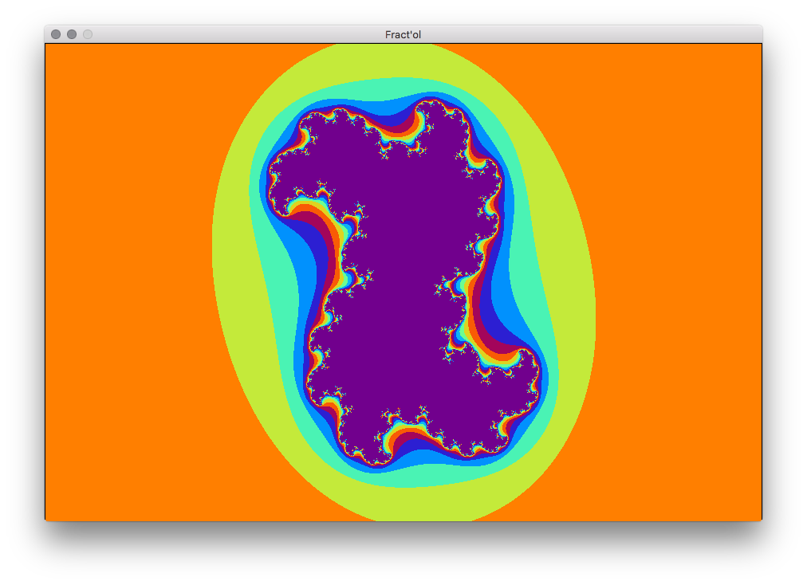
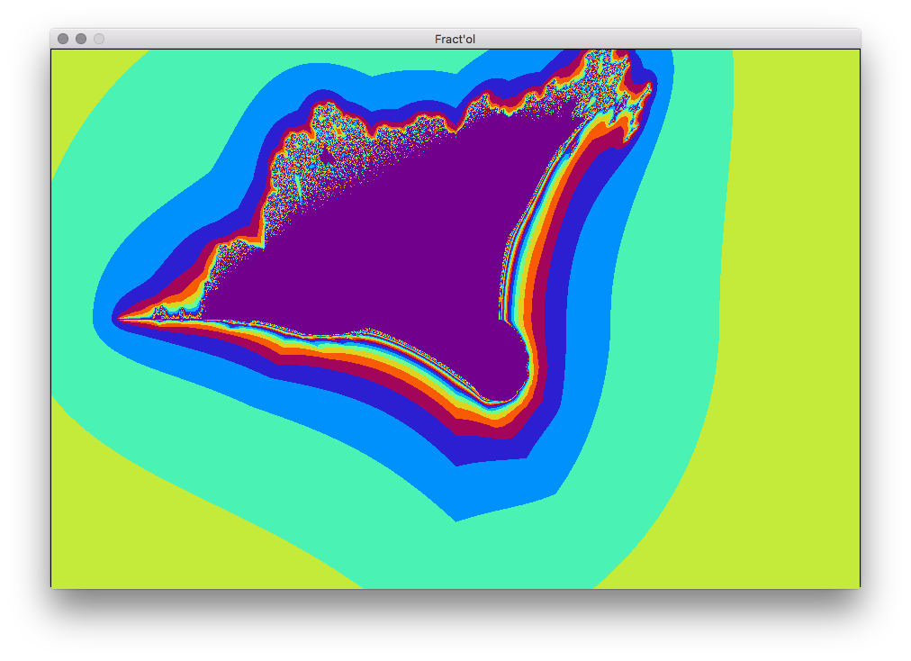
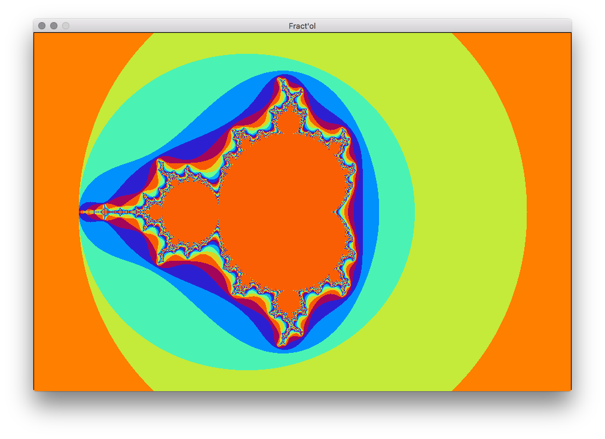

# fractol

Fract'ol is a School 42 project done with the minilibx.

The purpose of this project is to create fractal renderer.

### Usage
```
make && ./fractol [mandelbrot / julia / burning_ship]
```

   
